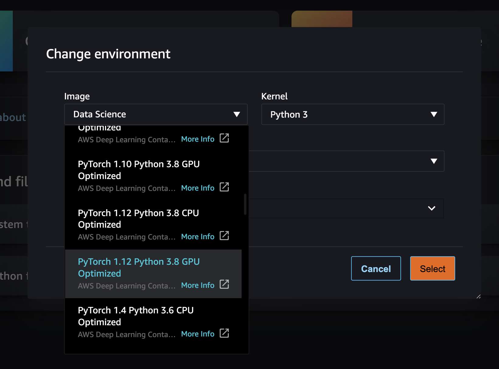
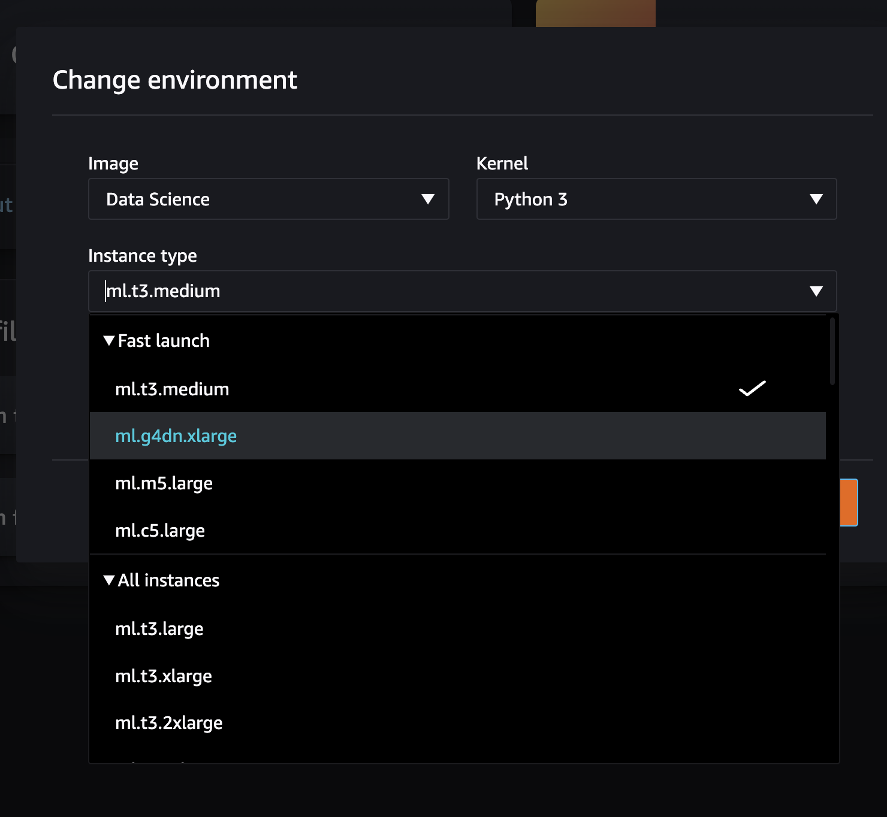
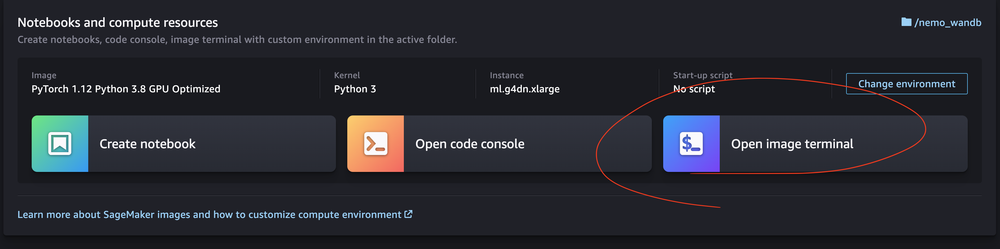

# Nemo and W&B workshop

Here is the code for the workshop "Training and Tunning a Text to speech model with Nvidia NeMo and Weights and Biases".

## Installation

If you are running in SageMaker you will have to choose an image with Pytorch and GPU capabilities. 
- Choose Pytorch image from the `Environment` drop down menu


- Choose a GPU equiped machine


- Open a terminal on the machine and clone this repo using `git clone`


- Run the `setup.sh` script inside the Machine Image terminal.
```
> bash sm_setup.sh
```


## Running the code

Follow the notebooks in order
- [01_log_datasets.ipynb](01_log_datasets.ipynb) will download the data and create a train/valid split. You will learn how to store your data on Weights and Biases.
- [02_FastPitch_finetune.ipynb](02_FastPitch_finetune.ipynb) You will fine tune a `FastPitch` model on a particular speaker. We will then analyse the results using `wandb.Tables`s